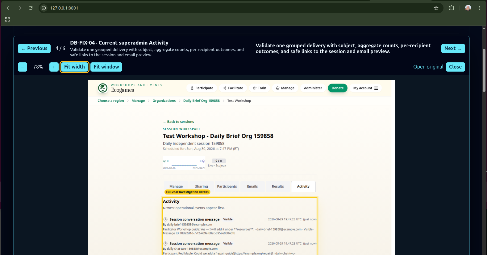

# Canonical approval review bundle

Use this concrete structure when asking a product owner to approve an ATDD
contract change. It is deliberately specific so separate agent sessions do not
invent incompatible approval presentations.



The screenshot above is the visual source of truth: the stable ID/title,
position, exact validation ask, Previous/Next navigation, image zoom controls,
clean-original link, and evidence remain visible together. Written guidance
clarifies this layout; it must not be used to justify a materially different
presentation.

## Default: four summary items, optional complete detail

Lead with a TLDR overview and a prominent **Start presentation · 4 items**.
Use these four questions as the default narrative, combining proportional context:

1. **Why / decision:** the user outcome, reason for the change and recommendation.
2. **What changes:** the important before/proposed or before/after experience and
   the precise behavior being agreed; show reuse/simplification briefly.
3. **Proof / limits:** verification results, meaningful risks, external effects,
   schema impact when present, and links to exact evidence and governing diffs.
4. **Action / status:** the smallest remaining approval or next action, and what
   has already been approved. Do not ask again about settled work.

Four is a default, not a quota; use fewer for a small decision and at most six
when justified. Put complete scenarios, exact diffs and retained history in
collapsed page sections with a separate **Start detailed presentation** control.
A summary is not permission to omit an affected step, changed governing document,
material risk or unresolved question. Link directly from the summary to each.
The reviewer can enter the relevant detail without paging through old history.

Page and deck must match **within each sequence**. Summary and detail have their
own counters and ordered item lists. Mark every item `NEW — REVIEW`,
`CHANGED — REVIEW AGAIN`, `APPROVED` or `UNCHANGED`. New work does not reopen
approved material. Preserve the full review in Git before compacting it in place.

The screenshot above governs individual item hierarchy and image controls; it
is not a requirement to put all historical evidence in the default presentation.
The following eight-item example is an **optional detailed sequence**, not the
mandatory opening deck.

## Exact diffs include governing documents

Render complete changes to acceptance scenarios and important governing text:
UI/style guides, AGENTS/CLAUDE, policies, standards, manuals, runbooks, architecture,
ADRs and durable plans. Show green additions, red removals, amber hunk headers and
muted file metadata in the page and detailed deck. Raw links are secondary; an
unstyled tab, plain preformatted text or summary of the change is insufficient.
Check light/dark contrast and keep the document path visible. For new documents,
show the added text. For moved guidance, show the removal and its destination so
reviewers can distinguish relocation from lost requirements.

## Example decision

The example is the Ecojeux facilitator post-workshop increment: facilitators
receive an ordinary final-batch Cc whose resource action opens the same
participant-facing session space, and their messages in that space have a
distinct bubble and sparkles icon.

When this detail is needed, the page detail section and detailed deck contain
these eight items in this order:

1. **`FAC-WHY · Investment case`** — “Validate that this user-trust gap is
   worth a small, bounded product increment before reviewing its detailed
   contract.” State why now, the consequences of doing nothing, expected value,
   bounded investment, risks/mitigations, and the recommendation. Use this only
   when the decision is important or expensive enough to benefit from it.
2. **`FAC-CHAT-04 · Current step 4/5`** — show the one current screenshot. Above
   it and in the deck, repeat one message asking whether a participant should
   identify facilitator messages by their distinct bubble and sparkles icon.
   State that the current bubble distinguishes only “mine” from “other,” then
   describe the proposed fixture and assertions. Do not manufacture a duplicate
   before/after image.
3. **`FAC-MAIL-13 · Current delivered-email step`** — show the delivered email
   in an email-reader wrapper, not a web preview. Repeat one message asking
   whether the ordinary facilitator Cc should open the participant-facing space
   without a participant token. State the current special-copy assertion and
   the proposed safe To/Cc/Bcc, subject, body, token, and navigation assertions.
4. **`FAC-DIFF · Exact executable contract diff`** — render the complete diff
   in the page and deck: additions in green, removals in red, hunk headers in
   amber, and file metadata muted. Retain a raw diff link only as a secondary
   artifact. This is the exact proposed scenario change, not a prose summary or
   an unstyled tab substituted for the diff.
5. **`FAC-CODE · Implementation preview · Reuse and simplification`** — show a
   short code excerpt or request-flow sketch of the planned solution. Name
   owning repositories/layers, inspected package versions and existing helpers
   reused, code removed or simplified, and minimal new code that remains
   necessary. Identify and justify any duplicated responsibility. For this
   example, explain reuse of ordinary final-batch Cc and participant-space
   authorization rather than a new special-email or parallel chat path. A
   preview is not acceptance evidence or a frozen implementation contract;
   completed evidence records actual reuse and material departures.
6. **`FAC-SCHEMA · Domain schema impact`** — include this item only when a
   domain changed, with the consolidated colored union diff. Otherwise state
   “No schema change” once in the summary; omit an empty schema slide.
7. **`FAC-EXT · External-system impact`** — name Brevo and the exact boundary:
   production transport, write effect, envelope change, personal data, logging,
   retries, and absence of new providers, credentials, webhooks, Luma calls, or
   API contracts. Name every other external system touched, or explicitly state
   that there is none.
8. **`FAC-APPROVAL · Approval requested`** — ask the smallest explicit product-
   contract questions that authorize the preceding diff. State what happens
   after approval and that completed evidence will be reviewed before push.

## Required page and deck behavior

- The normal page contains every item and remains usable without opening the
  dialog. Opening the deck is for focus and legibility, never for discovering
  hidden requirements.
- Give every page item the same `current/total` number as its slide and render
  that number exactly once per surface. The page and deck contain the same
  ordered items, state badges, asks, explanations, diffs and approval choices
  within the selected summary or detail sequence.
- Treat the presentation control bar as designed UI: group zoom/fit/original
  controls, keep navigation visually separate, and keep `Next` at the far
  right. A text-only item clears the image area instead of retaining a stale
  screenshot.
- Every item has a stable short ID. The heading, thumbnail label, and deck title
  repeat the same ID and context.
- The concise validation ask is verbatim on the page and in the deck. The deck
  also repeats the page's current/proposed explanation; it must not replace it
  with different or additional instructions.
- `← Previous` and `Next →` traverse all review items—not only PNGs—including
  exact diffs, schema and external-system impacts, risks, and approval. Show a
  position counter and support left/right arrow keys.
- Image slides additionally provide `−`, `+`, a persistent radio choice between
  `Fit width` and `Fit window`, and a clean-original link. Preserve page scroll
  position and keep the selected fit mode across slides.
- Reuse one canonical bundle path for every review round in the goal; update its
  canonical `docs/YYYY-MM-DD-<topic>.html` in place so the already-open watched tab reloads.
- In final evidence, put the preserved `Before` screenshot on the left and the
  new `After` screenshot on the right whenever the same visible state changed.
  Use an isolated worktree when needed to reproduce the before code. Show one
  image for unchanged evidence.
- A previous-release screenshot is never shown alone as current evidence. Pair
  it with the corresponding current/proposed state on the same item and slide.
- Put annotation labels outside the image as HTML, with an HTML/CSS outline over
  the immutable screenshot. Browser-check the coordinates. When the new UI does
  not exist, add a labelled HTML insert or code-native mock beside the current
  screenshot so the visual intent is reviewable before implementation.
- Email evidence shows the actual delivered message in an email wrapper with
  subject, safe envelope, rendered body, footer, and styling.
- The bundle identifies `PROPOSAL` or `COMPLETED EVIDENCE`, worktree, commit,
  generation time, and whether the domain schema changed.

## Second model: event-admin workflow review

For a workflow spanning creation, operational editing and dispatch, use one
continuous numbered page/deck:

1. Pair every changed state `Before`/`After` side by side; do not split the pair
   into adjacent slides.
2. Show a proposed compact toolbar or match panel as an HTML/code-native insert
   beside the highlighted current area when implementation does not exist yet.
3. Include the complete ordered scenario when the decision depends on the whole
   journey, while marking unchanged steps `UNCHANGED` so they provide context
   without reopening settled behavior.
4. Keep exact diffs, schema/external-system impact, operational evidence and the
   final approval item in the same sequence.
5. Browser-drive every Next action and prove positions advance exactly once from
   `1/N` to `N/N`; verify that page positions match and the final approval item
   is last.

Both are optional detail models beneath the compact overview. Use the workflow
model when several changed surfaces only make sense in their complete journey;
it does not require expanding the default summary deck.

## Implementation preview template

```text
CODE-01 · Implementation preview · Reuse and simplification

Ask: Validate the responsibility split and reuse choices.
Planned shape: <short code excerpt or request-flow sketch; owning repos/layers>
Reuse: <existing helper/package/infrastructure rule and inspected version>
Simplify: <code deleted, consolidated or avoided>
New code: <minimum necessary behavior and why reuse does not cover it>
Duplication: <none, or explicit overlap and justification>
Deployment evidence: <configuration actually inspected; unknowns labelled>
Completed implementation: <actual reuse/simplification and material departures>
```

For browser metrics, distinguish shared nginx scanner filtering from application
measurement semantics such as browser execution, CSRF, daily deduplication and
authenticated-admin exclusions. Do not claim an edge rule is deployed merely
because a vendored default enables it. Do not turn the preview into a detailed
source listing or substitute it for the exact acceptance-contract diff.

## Investor-style preamble template

Use these labels and answer them in plain product language:

```text
WHY-01 · Investment case

Ask: Validate that <problem> is worth <bounded investment> before reviewing the
detailed contract.

Why now: <observable trigger or opportunity>
If we do nothing: <user, operational, trust, revenue, or learning consequence>
Expected value: <reusable outcome rather than implementation output>
Bounded investment: <what is reused, what changes, and what is excluded>
Risks and mitigations: <material failure modes and how acceptance addresses them>
Recommendation: <approve, defer, reduce, or reject—and why>
```

Do not describe token spend as if it were the product outcome. The preamble
exists to justify the expected value relative to cost and risk, not to pressure
the reviewer into approval.
